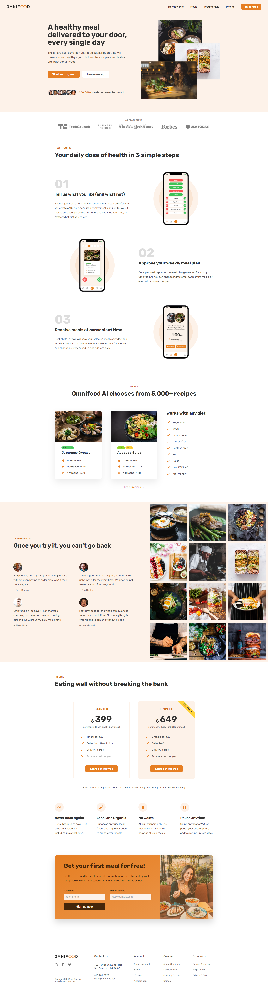

# ∞ Omnifood

Omnifood is a landing page for the smart 365-days-per-year food subscription that will make you eat healthy again. It was designed and developed using HTML, CSS, and vanilla JavaScript, with responsive design incorporated to ensure mobile-friendliness.

## Deployment

Deployed Website: https://omnifood-stergios.netlify.app

## Built With

- [HTML](https://developer.mozilla.org/en-US/docs/Web/HTML)
- [CSS](https://developer.mozilla.org/en-US/docs/Web/CSS)
- [JavaScript](https://developer.mozilla.org/en-US/docs/Web/javascript)

## Getting Started

To get started with project just simply fork this repo or download locally on your System.
